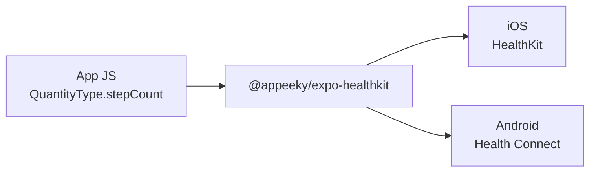

# @appeeky/expo-healthkit

Apple [HealthKit](https://developer.apple.com/documentation/healthkit) and Android [Health Connect](https://developer.android.com/health-and-fitness/guides/health-connect) for [Expo](https://expo.dev) and React Native, built on the [Expo Modules API](https://docs.expo.dev/modules/overview/).

One JavaScript API on both platforms. You pass Apple HealthKit type identifiers (`HKQuantityTypeIdentifierStepCount`, …), query or save samples, and the native layer talks to HealthKit on iOS and Health Connect on Android.


|              | iOS                                       | Android                                          |
| ------------ | ----------------------------------------- | ------------------------------------------------ |
| Backend      | HealthKit                                 | Health Connect                                   |
| App code     | Same identifiers and methods              | Same identifiers and methods                     |
| Availability | `isAvailable()` when HealthKit is present | `isAvailable()` when Health Connect is installed |


- Expo SDK 53+ / New Architecture (tested on SDK 57)
- Promise-based TypeScript API
- Config plugin for HealthKit entitlements **and** Health Connect permissions (`minSdk` 26)
- iOS 16.4+, Android 8+ (API 26+). Web reports `isAvailable() === false`

> Health data APIs cannot run in Expo Go. Use a development build (`npx expo run:ios` or `npx expo run:android`).


## 📋 Requirements

- Expo SDK 53 or later and a **development build** (not Expo Go)
- iOS 16.4+, physical iPhone or Simulator, with the HealthKit capability enabled on the App ID in the [Apple Developer portal](https://developer.apple.com/account)
- Android 8+ with [Health Connect](https://play.google.com/store/apps/details?id=com.google.android.apps.healthdata) (built-in on Android 14+)


## 📦 Install

```sh
npx expo install @appeeky/expo-healthkit
```

From GitHub, if you are tracking `main` before a release:

```sh
npx expo install github:appeeky/expo-healthkit
```

Add the config plugin in `app.json` / `app.config.ts`:

```json
{
  "expo": {
    "plugins": [
      [
        "@appeeky/expo-healthkit",
        {
          "healthSharePermission": "Allow $(PRODUCT_NAME) to read your health data",
          "healthUpdatePermission": "Allow $(PRODUCT_NAME) to write health data",
          "isBackgroundDeliveryEnabled": true
        }
      ]
    ],
    "ios": {
      "bundleIdentifier": "com.example.app"
    }
  }
}
```

Then rebuild native code:

```sh
npx expo prebuild --clean
npx expo run:ios
# or
npx expo run:android
```

Enable the **HealthKit** capability on the App ID in the Apple Developer portal. The plugin writes the entitlement into the generated Xcode project; the capability still has to be allowed for that bundle ID.

On Android, install [Health Connect](https://play.google.com/store/apps/details?id=com.google.android.apps.healthdata) if the OS does not already include it (built-in on Android 14+). The plugin declares the Health Connect permissions and raises `minSdk` to 26.

## ⚡️ Quick start

```ts
import * as HealthKit from '@appeeky/expo-healthkit';

if (!HealthKit.isAvailable()) {
  return;
}

await HealthKit.requestAuthorization({
  toRead: [
    HealthKit.QuantityType.stepCount,
    HealthKit.QuantityType.heartRate,
    HealthKit.CategoryType.sleepAnalysis,
    HealthKit.WorkoutType.workout,
  ],
  toShare: [HealthKit.QuantityType.stepCount],
});

const today = new Date();
today.setHours(0, 0, 0, 0);

const steps = await HealthKit.queryStatistics({
  type: HealthKit.QuantityType.stepCount,
  unit: HealthKit.Unit.count,
  from: today,
  to: new Date(),
  options: HealthKit.StatisticsOption.cumulativeSum,
});

const heartRate = await HealthKit.queryQuantitySamples({
  type: HealthKit.QuantityType.heartRate,
  unit: HealthKit.Unit.countPerMinute,
  from: today,
  to: new Date(),
  limit: 20,
  ascending: false,
});
```


## 📚 API


### 🔐 Availability and permissions


| Method                                                  | Notes                                                                                            |
| ------------------------------------------------------- | ------------------------------------------------------------------------------------------------ |
| `isAvailable()`                                         | `true` on iOS when HealthKit is present, and on Android when Health Connect is installed         |
| `requestAuthorization({ toRead, toShare })`             | Shows the system permission sheet (HealthKit or Health Connect)                                  |
| `getAuthorizationStatus(type)`                          | iOS: reliable for **write** types. Android: reflects granted Health Connect read or write access |
| `getRequestStatusForAuthorization({ toRead, toShare })` | Whether you still need to prompt                                                                 |


On iOS, read authorization is intentionally opaque: `getAuthorizationStatus` returning `notDetermined` / `sharingDenied` does **not** mean the user blocked reads.

### 📊 Samples and statistics


|     | Method                                                                    | Use for                                                       |
| --- | ------------------------------------------------------------------------- | ------------------------------------------------------------- |
| ❤️  | `queryQuantitySamples({ type, unit, from, to, limit, ascending })`        | Heart rate, weight, glucose, …                                |
| 😴  | `queryCategorySamples({ type, from, to, limit, ascending })`              | Sleep, mindful sessions, …                                    |
| 🏃  | `queryWorkouts({ from, to, limit, ascending, activityType })`             | Workouts                                                      |
| 🫀  | `queryElectrocardiograms({ from, to, limit, ascending, includeVoltage })` | ECG samples. Voltage is omitted unless `includeVoltage: true` |
| 🔴  | `queryActivitySummaries({ from, to })`                                    | Move / Exercise / Stand rings                                 |
| 🏥  | `queryClinicalRecords({ type, from, to, limit, ascending })`              | FHIR clinical records. Needs `isClinicalDataEnabled`          |
| 👂  | `queryAudiograms({ from, to, limit, ascending })`                         | Hearing-test audiograms                                       |
| 📍  | `queryWorkoutRoute({ workoutUUID })`                                      | GPS locations for a workout                                   |
| 🩺  | `queryCorrelations({ type, from, to, limit, ascending })`                 | Blood pressure and food correlations                          |
| 💓  | `queryHeartbeatSeries({ from, to, limit, ascending, includeBeats })`      | Beat-to-beat series used for HRV                              |
| 📈  | `queryStatistics({ type, unit, from, to, options })`                      | Totals / min / max / average for a range                      |
| 📅  | `queryStatisticsCollection({ type, unit, from, to, interval, options })`  | Daily (or hourly) buckets                                     |
| 🔄  | `queryAnchored({ type, unit, from, to, limit, anchor })`                  | Incremental sync. Store `anchor` and pass it back             |


`limit` defaults to HealthKit's unlimited query. Dates accept `Date` or ISO-8601 strings. Units are HealthKit unit strings (`count`, `count/min`, `kcal`, `kg`, `m`, `%`, …) also exported as `Unit`.

ECG, activity rings, clinical records, audiograms, workout GPS routes, heartbeat series, and correlations are not quantity/category/workout samples. Request the matching identifier in `toRead`:

```ts
await HealthKit.requestAuthorization({
  toRead: [
    HealthKit.ElectrocardiogramType.electrocardiogram,
    HealthKit.ActivitySummaryType.activitySummary,
    HealthKit.ClinicalType.allergyRecord,
    HealthKit.AudiogramType.audiogram,
    HealthKit.WorkoutType.workout,
    HealthKit.SeriesType.workoutRoute,
    HealthKit.SeriesType.heartbeat,
    HealthKit.CorrelationType.bloodPressure,
    HealthKit.CorrelationType.food,
  ],
});

const rings = await HealthKit.queryActivitySummaries({ from: today });
const [workout] = await HealthKit.queryWorkouts({ limit: 1 });
const routes = workout
  ? await HealthKit.queryWorkoutRoute({ workoutUUID: workout.uuid })
  : [];
const pressure = await HealthKit.queryCorrelations({
  type: HealthKit.CorrelationType.bloodPressure,
  limit: 20,
});
```

Clinical reads also need `isClinicalDataEnabled: true` on the config plugin.

### ✍️ Write / delete

```ts
await HealthKit.saveQuantitySample({
  type: HealthKit.QuantityType.stepCount,
  unit: HealthKit.Unit.count,
  value: 100,
  startDate: new Date(Date.now() - 60_000),
  endDate: new Date(),
});

await HealthKit.saveCategorySample({
  type: HealthKit.CategoryType.sleepAnalysis,
  value: HealthKit.SleepAnalysisValue.asleepCore,
  startDate,
  endDate,
});

await HealthKit.saveWorkout({
  activityType: HealthKit.WorkoutActivityType.running,
  startDate,
  endDate,
  energyBurned: 400,
  energyBurnedUnit: HealthKit.Unit.kilocalorie,
  distance: 5000,
  distanceUnit: HealthKit.Unit.meter,
});

await HealthKit.saveCorrelation({
  type: HealthKit.CorrelationType.bloodPressure,
  startDate: new Date(),
  objects: [
    {
      type: HealthKit.QuantityType.bloodPressureSystolic,
      unit: HealthKit.Unit.millimeterOfMercury,
      value: 120,
    },
    {
      type: HealthKit.QuantityType.bloodPressureDiastolic,
      unit: HealthKit.Unit.millimeterOfMercury,
      value: 80,
    },
  ],
});

await HealthKit.deleteObjects({
  type: HealthKit.QuantityType.stepCount,
  uuid,
});
```


### 👤 Characteristics

`getBiologicalSex()`, `getBloodType()`, `getDateOfBirth()`, `getFitzpatrickSkinType()`, `getWheelchairUse()`. These are read-only HealthKit characteristics; include the matching `CharacteristicType` in `toRead`.

### 🔔 Background updates

```ts
await HealthKit.observe([HealthKit.QuantityType.stepCount]);

const subscription = HealthKit.addUpdateListener(({ type }) => {
  // Re-query that type
});

await HealthKit.enableBackgroundDelivery(
  HealthKit.QuantityType.stepCount,
  HealthKit.UpdateFrequency.hourly
);
```

`useHealthKitUpdates()` is a React hook around the same event.

Background delivery needs `isBackgroundDeliveryEnabled: true` on the config plugin and the HealthKit background mode.

## 🏷️ Identifiers

Pass Apple's raw identifier strings. Named constants are provided for autocomplete; unknown identifiers still work if HealthKit knows them.

```ts
HealthKit.QuantityType.stepCount
// 'HKQuantityTypeIdentifierStepCount'

HealthKit.queryQuantitySamples({
  type: 'HKQuantityTypeIdentifierStepCount',
  unit: 'count',
});
```

App code should keep using Apple identifier strings on both platforms. See [Cross-platform](#cross-platform) for what Health Connect maps, what stays iOS-only, and how to handle those APIs without `Platform.OS` forks.

## 🌍 Cross-platform

JavaScript always speaks HealthKit. You never pass Health Connect record class names from app code. The native layer chooses the backend:



Mapped types (steps, heart rate, sleep, workouts, weight, blood pressure, nutrition, …) use the **same method and identifier** on both platforms. Unmapped identifiers are skipped in Android `requestAuthorization`. Calling an Apple-only method on Android throws `ERR_HEALTH_CONNECT_UNSUPPORTED` instead of requiring `if (Platform.OS === 'ios')` on every query.

Hide Apple-only UI by catching that code:

```ts
try {
  const rings = await HealthKit.queryActivitySummaries({ from: today });
} catch (error) {
  if (error instanceof Error && 'code' in error && error.code === 'ERR_HEALTH_CONNECT_UNSUPPORTED') {
    return;
  }
  throw error;
}
```

### What works on both

| Area | Identifiers / methods |
| --- | --- |
| Activity | `QuantityType.stepCount`, walking/running/cycling/swimming/wheelchair distance, `flightsClimbed`, `pushCount`, `activeEnergyBurned`, `basalEnergyBurned` |
| Heart | `heartRate`, `restingHeartRate`, `heartRateVariabilitySDNN`, `vo2Max`, `oxygenSaturation`, `respiratoryRate` |
| Body | `bodyMass`, `height`, `bodyFatPercentage`, `leanBodyMass`, `bodyTemperature`, `bloodGlucose` |
| Blood pressure | `CorrelationType.bloodPressure` plus systolic / diastolic quantities |
| Nutrition | `CorrelationType.food`, `dietaryWater`, other `HKQuantityTypeIdentifierDietary*` types |
| Sleep | `CategoryType.sleepAnalysis` |
| Workouts | `queryWorkouts` / `saveWorkout` (`WorkoutActivityType` mapped onto Health Connect exercise types) |
| Aggregates | `queryStatistics`, `queryStatisticsCollection`, `queryAnchored` |
| Writes | `saveQuantitySample`, `saveCategorySample`, `saveCorrelation`, `deleteObjects` |

### iOS-only

These throw `ERR_HEALTH_CONNECT_UNSUPPORTED` on Android. Health Connect has no equivalent (or no stable mapping yet):

| API | Why |
| --- | --- |
| `queryElectrocardiograms` | Apple Watch ECG |
| `queryActivitySummaries` | Move / Exercise / Stand rings |
| `queryClinicalRecords` | FHIR health records |
| `queryAudiograms` | Hearing-test charts |
| `queryWorkoutRoute` | Workout GPS polylines |
| `queryHeartbeatSeries` | Beat-to-beat series |
| `getBiologicalSex`, `getBloodType`, `getDateOfBirth`, `getFitzpatrickSkinType`, `getWheelchairUse` | HealthKit characteristics |
| `observe`, `enableBackgroundDelivery` | HealthKit observer queries / background delivery |

### Behavioral differences

| | iOS | Android |
| --- | --- | --- |
| Backend | HealthKit | Health Connect (`connect-client` 1.1) |
| `isAvailable()` | HealthKit present | Health Connect installed (built-in on Android 14+; otherwise the Health Connect app) |
| Read permission | Apple does **not** disclose read grants | `getAuthorizationStatus` reflects granted Health Connect read or write |
| Unmapped types in `requestAuthorization` | Forwarded if HealthKit knows them | Skipped |
| History window | Granted samples, any age | Often last **30 days** unless the user also grants history access (the SDK requests it) |
| Anchored sync | `HKQueryAnchor` (opaque string) | Health Connect changes token (opaque string). Do not reuse an iOS anchor on Android |
| HRV | SDNN | Mapped to Health Connect RMSSD on the same `heartRateVariabilitySDNN` identifier — not the same statistic |
| Workout GPS | `queryWorkoutRoute` | Unsupported |
| `minSdk` | iOS 16.4 | API 26 (plugin raises it) |

Do **not** fork mapped queries per platform. Fork only when you need different UI for an Apple-only feature.

## 🔌 Config plugin


| Prop                              | Default                                            | Purpose                                                         |
| --------------------------------- | -------------------------------------------------- | --------------------------------------------------------------- |
| `healthSharePermission`           | `"Allow $(PRODUCT_NAME) to read your health data"` | `NSHealthShareUsageDescription`                                 |
| `healthUpdatePermission`          | `"Allow $(PRODUCT_NAME) to write health data"`     | `NSHealthUpdateUsageDescription`                                |
| `healthClinicalRecordsPermission` | clinical default                                   | Used when `isClinicalDataEnabled` is true                       |
| `isBackgroundDeliveryEnabled`     | `false`                                            | HealthKit background delivery entitlement + `UIBackgroundModes` |
| `isClinicalDataEnabled`           | `false`                                            | `health-records` access                                         |
| `healthConnectPrivacyPolicyUrl`   | —                                                  | Shown on the Health Connect permission rationale screen         |


The plugin also sets `android.minSdkVersion` to 26 (Health Connect’s floor) unless the project already uses a higher value.

Set a permission string to `false` to skip writing that Info.plist key (if you manage it yourself).

## 📱 Example app

```sh
cd example
npm install
npx expo run:ios
# or
npx expo run:android
```

The example is an Expo SDK 57 app that autolinks this module on **iOS and Android**. It will not work in Expo Go.

## 🤖 Agent skills

Coding agents (Cursor, Claude Code, Copilot, and similar) should load the bundled skill.

Copy [`.cursor/skills/expo-healthkit/`](https://github.com/appeeky/expo-healthkit/tree/main/.cursor/skills/expo-healthkit) into your app’s `.cursor/skills/expo-healthkit/` (or the agent’s skills folder):

| File | What agents get |
| --- | --- |
| [`SKILL.md`](https://github.com/appeeky/expo-healthkit/blob/main/.cursor/skills/expo-healthkit/SKILL.md) | When to use which query, auth rules, and plugin flags |
| [`reference.md`](https://github.com/appeeky/expo-healthkit/blob/main/.cursor/skills/expo-healthkit/reference.md) | Method signatures, units, identifiers |
| [`examples.md`](https://github.com/appeeky/expo-healthkit/blob/main/.cursor/skills/expo-healthkit/examples.md) | Copy-paste flows (steps, sleep, rings, blood pressure, food) |

The skill tells the agent to pass Apple identifier strings through one query/save API on iOS and Android, request every type in `toRead`, and rebuild native code after Swift, Kotlin, or plugin changes.

## 🤝 Contributing

Issues and pull requests are welcome. Contributions are licensed under [PolyForm Shield 1.0.0](./LICENSE).

### Checks

CI on `main` and every PR runs lint, typecheck, Jest, and an `npm pack` contents check (`.github/workflows/ci.yml`). Run the same locally before opening a PR:

```sh
npm ci
npm run lint
npm run typecheck
npm test -- --watchAll=false
npm run test:coverage
```

`npm test` opens Jest watch mode on a TTY. Pass `--watchAll=false` (as CI does) for a single run. `test:coverage` writes an HTML report to `coverage/` and must stay green for the JavaScript that tests already cover (`src/identifiers.ts`, `src/errors.ts`, `src/dates.ts`).

### What to test

| Change | Expected coverage |
| --- | --- |
| Identifiers, errors, date helpers, public JS types | Add or extend Jest in `src/__tests__/`. Keep `npm run test:coverage` passing |
| Config plugin | Typecheck `plugin/`; if you add pure helpers, put Jest next to them |
| Kotlin Health Connect mapping | Update the [Cross-platform](#cross-platform) tables **and** `.cursor/skills/expo-healthkit/`. Run the example on an Android device with Health Connect |
| Swift HealthKit | Same skill/README update. Run the example on Simulator or a device with the HealthKit capability |
| Example UI | `cd example && npx expo run:ios` / `npx expo run:android`. Health APIs do not run in Expo Go |

Native HealthKit / Health Connect cannot run in Node. Device or Simulator verification is the coverage for Swift and Kotlin. Do not add `Platform.OS` branches in `example/` for types that already map.

### Native rebuild

Metro reload is not enough after Swift, Kotlin, or plugin edits:

```sh
npx expo prebuild --clean
npx expo run:ios
# or
npx expo run:android
```

### Docs

If the public API or Android mapping changes, update `README.md`, `CHANGELOG.md`, and `.cursor/skills/expo-healthkit/` (`SKILL.md`, `reference.md`, `examples.md`) in the same PR.

## 🔒 Privacy

Health data stays on-device unless your app uploads it. Request only the types you need, explain why in the iOS usage strings, declare the matching Health Connect data types in Play Console, and follow Apple HealthKit and Google Health Connect review guidelines. Android reads are often limited to the last 30 days unless the user also grants history access.

## 📄 License

[PolyForm Shield 1.0.0](./LICENSE). See [`LICENSE`](./LICENSE) for the full terms.

You **can** install and use this SDK inside your own Expo / React Native apps, including commercial products.

You **cannot** copy this SDK and sell, publish, or otherwise offer a competing HealthKit / Health Connect library based on it.